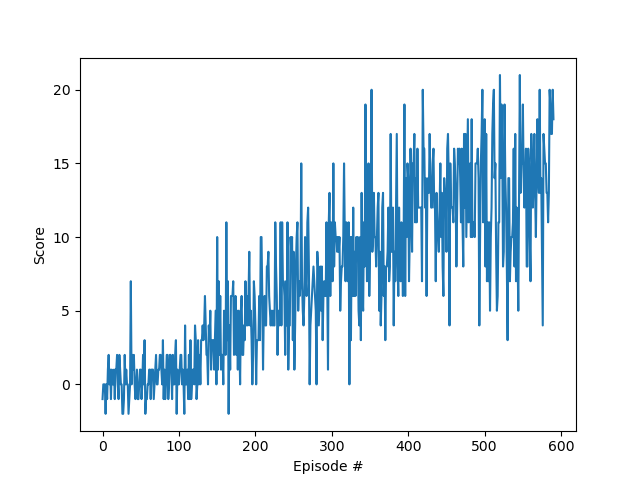

# Project report

## Learning Algorithm

The learning algorithm used in this project is a Double DQN. The neural network architecture consist of three fully connected layers. The starting input size is the state space dimension, 37, and the final ouput size is equal to the number of possible actions for the agent, 4. The remaining intput/output sizes are all equal to 64.

Values of other parameters:

- Epsilion decay rate: 0.995
- Min epsilon: 0.01
- Replay buffer size: 10000
- Discount factor: .99
- Learning rate: 0.0005
- Maximum steps per episode: 1000

## Plot of Rewards



```
Episode 100	Average Score: 0.41
Episode 200	Average Score: 2.89
Episode 300	Average Score: 6.25
Episode 400	Average Score: 9.31
Episode 500	Average Score: 12.76
Episode 591	Average Score: 13.01
Environment solved in 491 episodes!	Average Score: 13.01
Elapsed time: 647.732673406601
```

## Ideas for future work

The implementation of Prioritised Experience Replay (in branch `prioritized-experience`) is very slow and I would like to fix that. Other ideas include experimenting with enhancements of DQN's such as Dueling Deep Q Networks. 

Hyperparameter optimisation could be beneficial but requires extensive computation: creating a discrete grid space of the hyperparameters and to run each of them several times with different seeds